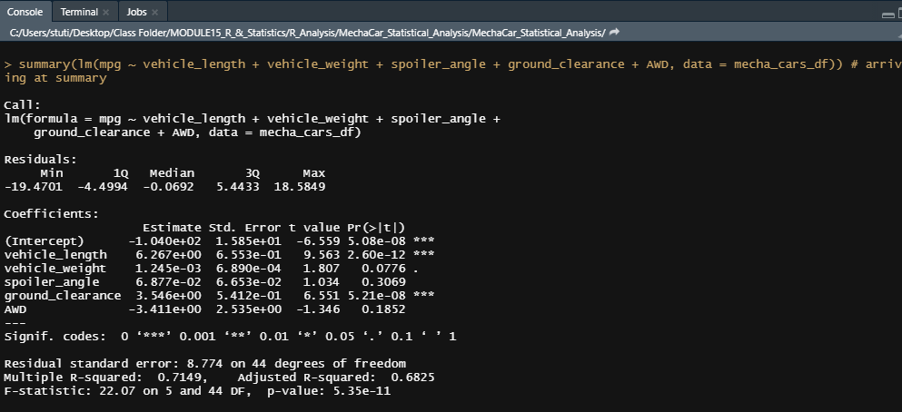

# MechaCar_Statistical_Analysis

## **Linear Regression to Predict MPG**
****

* Which variables/coefficients provided a non-random amount of variance to the mpg values in the dataset?

* Is the slope of the linear model considered to be zero? Why or why not?
The slope is not considered to be zero because of the very samll p-value at 5.35e-11. We've got enough evidence to reject the null hypotheis.

* Does this linear model predict mpg of MechaCar prototypes effectively? Why or why not?
This linear model predicts the mpg of MechaCar prototypes effectively. The multiple R-squared value of 0.7149 and the adjusted R-Squared value of 0.68 indicate  that there is a strong corelation between all factors provided with mpg.