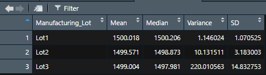
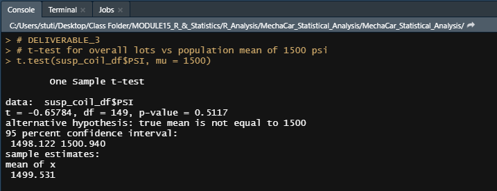
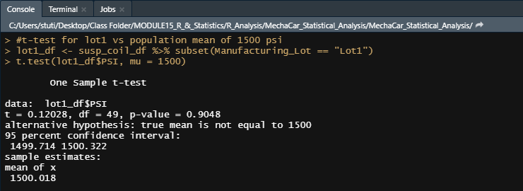
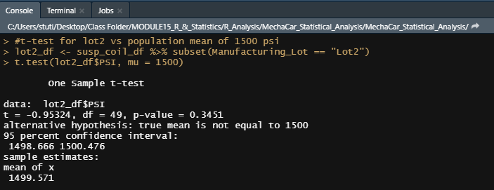
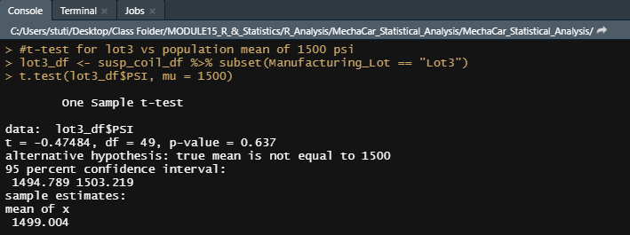

# MechaCar_Statistical_Analysis

## **Linear Regression to Predict MPG**
Summary_Mechcar

* Which variables/coefficients provided a non-random amount of variance to the mpg values in the dataset?
* Ans: The variables/coefficients provided a non-random amount of variance to the mpg values in the dataset are as follows:
i. ground clearance (p-value = 5.21 x 10^-8)
ii. vehicle length (p-value = 2.60 x 10^-12)
iii. intercept (p-value = 5.08 x 10^-8)
This is because their p-values are below the statistical significance level of 0.05.
Also, the  multiple R-squared and Adjusted R-squared values are 0.7149 and 0.6825 which implies almost 70% of the model should be correctly implimented.
Having said that, effect of ground clearance, vehicle length and intercept need to be taken into consideration for having an impact on mpg.

* Is the slope of the linear model considered to be zero? Why or why not?
* The slope is not considered to be zero because of the very samll p-value at 5.35e-11. We've got enough evidence to reject the null hypotheis.

* Does this linear model predict mpg of MechaCar prototypes effectively? Why or why not?
* This linear model predicts the mpg of MechaCar prototypes effectively. The multiple R-squared value of 0.7149 and the adjusted R-Squared value of 0.68 indicate  that there is a strong corelation between all factors provided with mpg.

## **Summary Statistics on Suspension Coils**
Total_summary

Lot_summary

* The design specifications for the MechaCar suspension coils dictate that the variance of the suspension coils must not exceed 100 pounds per square inch. Does the current manufacturing data meet this design specification for all manufacturing lots in total and each lot individually? Why or why not?
* As per the total summary for all three lots, the manufacturing data meets the requirement of the variance below 100 psi. But when we look at the individual lot sumarries, we find that lot 1 and 2 meet the variance requirements whereas lot 3 is way above the 100 psi limit.

## **T-Tests on Suspension Coils**
T-test overall

T_test_lot1

T_test_lot2

T_test_lot3

* We observed that the p-value for overall lots is 0.5117, for lot1 is 0.9048, for lot2 is 0.3451 and for lot3 is 0.637. These are all above the level of statstical significance of 0.05. Thus, we are not in a position to reject the Null hypothesis indicating that the lot has no effect on PSI.

## **Study Design: MechaCar vs Competition**
Due to increase in accidents on roads, I would like to compare the following features of MechaCar with competitor cars with special attention on advanced safety features like Electronic stability control, Traction control other than the regular features like Airbags, Antilock brakes, safety belts etc:
Model, Year of manufacture, Cost, Fuel Efficiency, Horse power, Maintenance, Safety Features.

* What metric or metrics are you going to test?
The metrics for comparison of MechaCar and competitor cars would be as follows:
          i. Model 
         ii. Year of manufacture
        iii.  Cost
         iv.  Fuel Efficiency
          v.  Horse power
         vi. Maintenance
        vii. Safety Features

* What is the null hypothesis or alternative hypothesis?
* Null Hypothesis: 
Having 2 advanced safety features (other than the regular safety features) in the MechaCar reduces the accidents on road by 30% more than the competitor brand.

* Alternate Hypothesis: 
Having 2 advanced safety features (other than the regular safety features) in the MechaCar has no effect on the rate of road accidents.

* What statistical test would you use to test the hypothesis? And why?
I would use multiple linear regression where manufacturer could be independent variable and no. of advanced safety features, cost, fuel efficiency, Horse power, Maintenance cost would be the dependent variables.

* What data is needed to run the statistical test?
I will need the data over 5 years for Mechacar and different brands for the below features:
 
* Model 
* Year of manufacture
* Cost
* Fuel Efficiency
* Horse power
* Maintenance
* Number of advanced Safety Features
